# Fleamarket

## Motivation

Fleamarket was the graudation project. Whenever I used Kijiji, I felt uncomfortable for its limited functionality. The main movitation of the application was providing simple and fast trading service. Fleamarket is E-commerse platform that allows local people exchange thier goods easily. It is a web application that supports responsive web design. 

## Technologies

The main point of this application is a real-time user interaction. To implement the functionality, we used web-socket since it effectively duplex communication. 

### Backend Technology
Node.js/Express.js Socket.IO MySQL Sequlize Redis 

### Frontend Technology
JavaScript HTML5 CSS3 React.JS

## Features

To provide easy trading experience, Fleamarket supports the following functionalities.

### Home
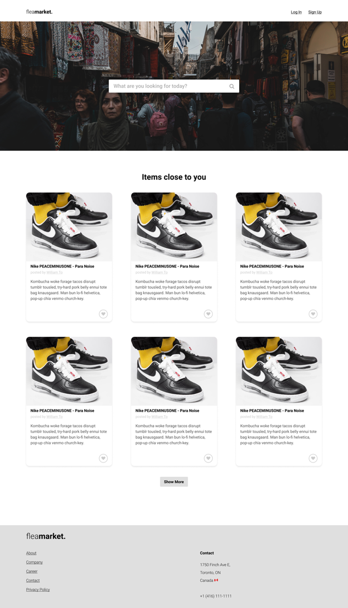

### User Account Management

#### Create an account.
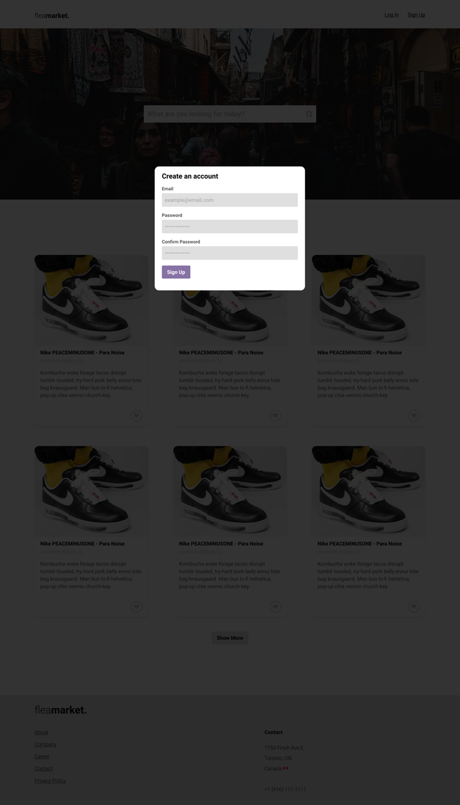

#### Login to account.
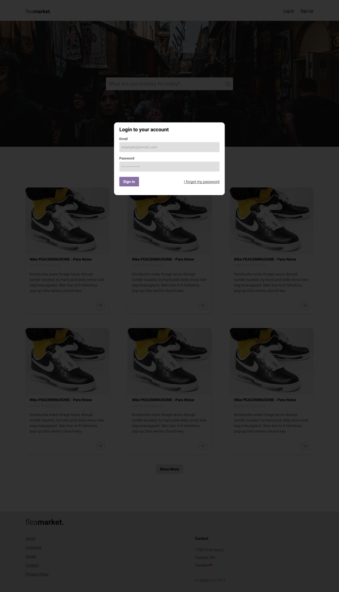

#### Edit account.
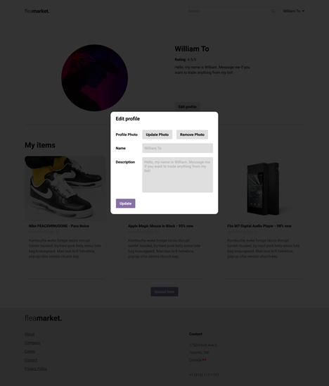

### Manage User Item
#### User's inventory.
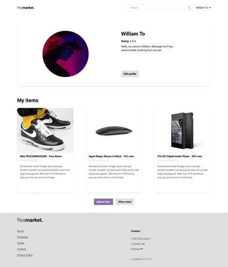

#### Upload item.
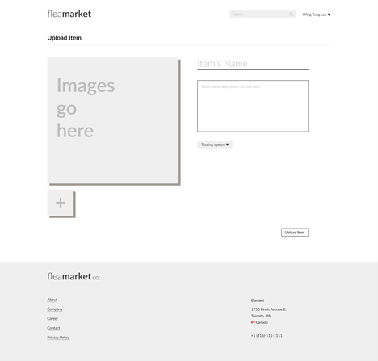

#### Delete Item.
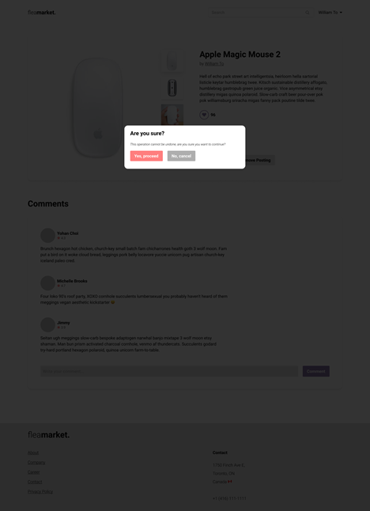

### Search Item

#### Visit user profile.
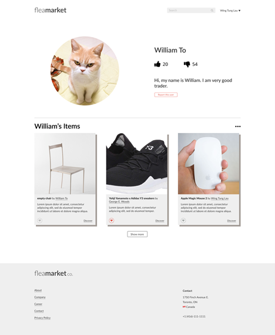

#### Item page
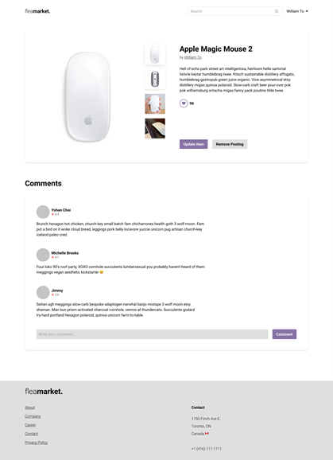

### Chatting
#### Sending and receiving message.
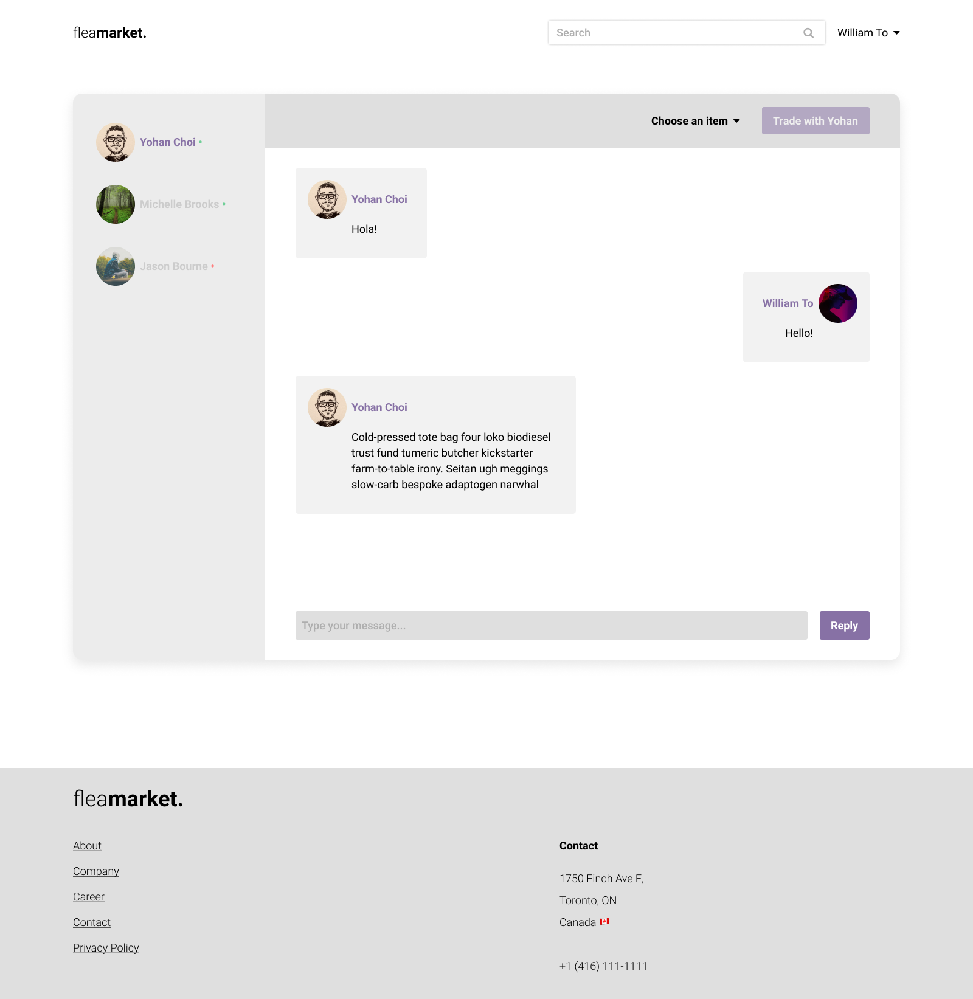

### Trading
#### Select item.
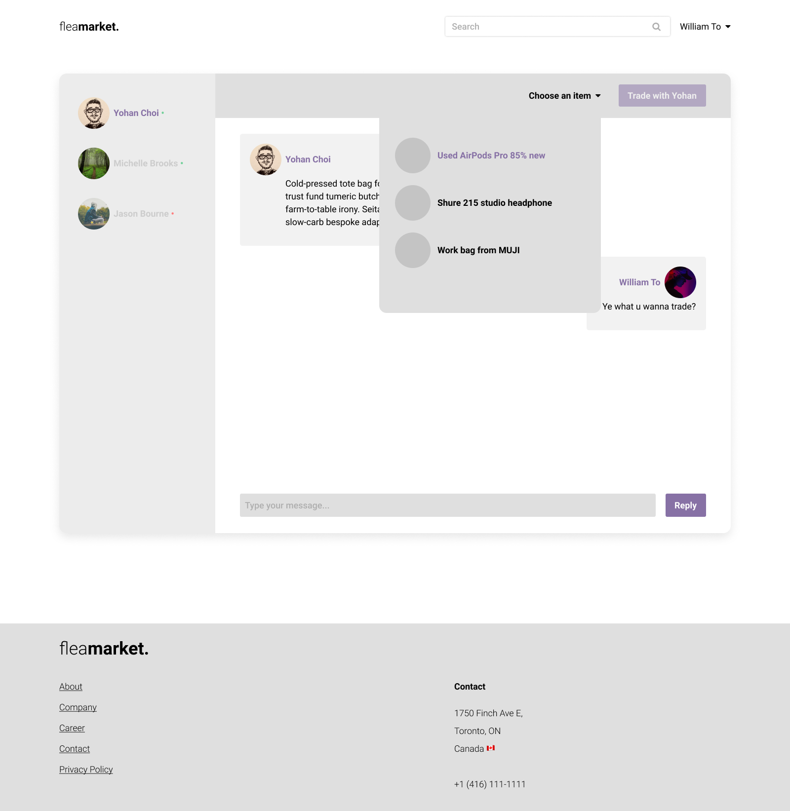

#### Pending another user.
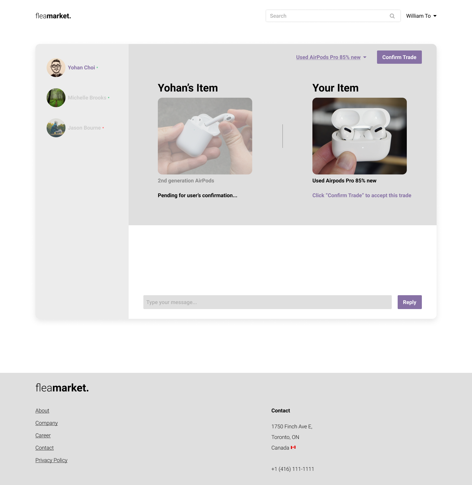

#### Both users confirm items.
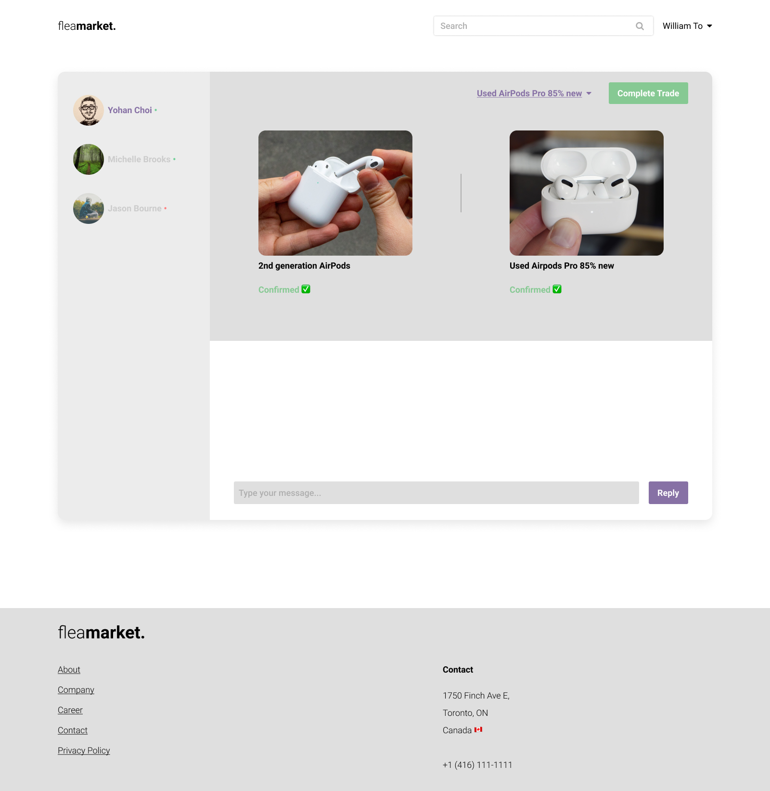

#### Rating user after trading.
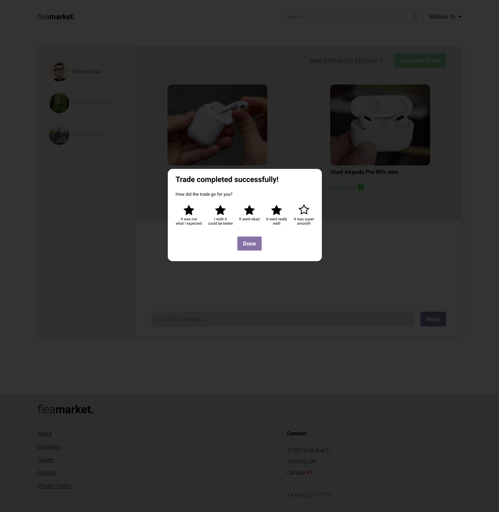

